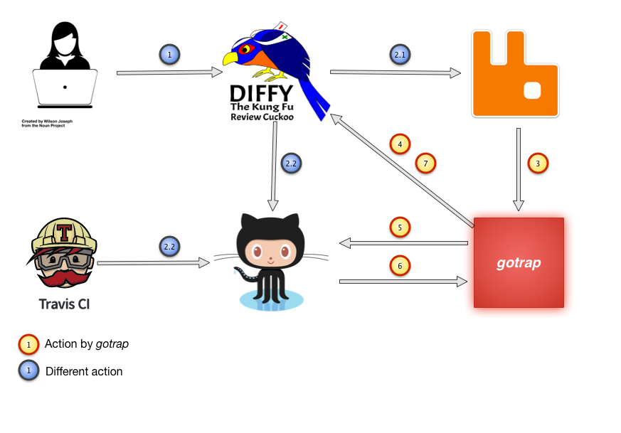

# gotrap

[](https://travis-ci.org/andygrunwald/gotrap)

[Gerrit](https://code.google.com/p/gerrit/), a code review tool, is often used in bigger projects with self hosted infrastructure like [TYPO3](https://review.typo3.org/), [Android](https://android-review.googlesource.com/), [HPDD (Intel)](http://review.whamcloud.com/), [Qt](https://codereview.qt-project.org/), [OpenStack](https://review.openstack.org/) or [Golang](https://go-review.googlesource.com/).
With a self hosted Git infrastructure there is no build in solution to benefit from hooks triggered by a Github Pull Request like the continuous integration service [Travis CI](https://travis-ci.org/) or similar.

**gotrap** is a Gerrit <=> Github <=> TravisCI bridge written in Go.

[](#how-does-gotrap-works)

A detailed description about every step you can find in [How does gotrap works?](#how-does-gotrap-works).

PS: You don`t have to use TravisCI. You can use every service which can be triggered by a pull request and reports back to the [commit status api](https://developer.github.com/v3/repos/statuses/) :wink:
Travis CI is only used as an example, because it is one of the most popular.

## Table of contents

1. [Features](#features)
2. [Examples](#examples)
3. [Requirements](#requirements)
4. [Installation](#installation)
5. [Usage](#usage)
6. [Configuration](#configuration)
	1. [gotrap `config.json`](#gotrap-configjson)
		1. [Configuration part `gotrap`](#configuration-part-gotrap)
		2. [Configuration part `github`](#configuration-part-github)
		3. [Configuration part `amqp`](#configuration-part-amqp)
		4. [Configuration part `gerrit`](#configuration-part-gerrit)
	2. [Gerrit plugin `replication`](#gerrit-plugin-replication)
	3. [Gerrit plugin `gerrit-rabbitmq-plugin`](#gerrit-plugin-gerrit-rabbitmq-plugin)
		1. [Exchange](#exchange)
		2. [Queue](#queue)
7. [Source code documentation](#source-code-documentation)
8. [Motivation](#motivation)
9. [Alternative implementations](#alternative-implementations)
	1. [Jenkins](#jenkins)
	2. [Gerrit plugin](#gerrit-plugin)
10. [FAQ](#faq)
	1. [How does gotrap works?](#how-does-gotrap-works)
	2. [Why JSON as config file format?](#why-json-as-config-file-format)
	3. [Which AMQP broker are supported?](#which-amqp-broker-are-supported)
	4. [What is about the Github API rate limit?](#what-is-about-the-github-api-rate-limit)
	5. [Can i start multiple Travis CI tests in parallel?](#can-i-start-multiple-travis-ci-tests-in-parallel)
11. [License](#license)
12. [Credits](#credits)

## Features

* Gerrit support
* Github support
* Concurrency (can handle more than one changeset per time)
* Multiple projects / branches support
* Exclude changesets by regular expression
* Templatable comments (Gerrit) and Merge Requests (Github)

## Examples

Here are some examples how gotrap can look like:

* [[BUGFIX] SelectViewHelper must respect option(Value|Label)Field for arrays](https://review.typo3.org/#/c/36909/) @ TYPO3 Gerrit: 
	* [Github PR](https://github.com/typo3-ci/TYPO3.CMS-pre-merge-tests/pull/20)
	* [Travis CI build](https://travis-ci.org/typo3-ci/TYPO3.CMS-pre-merge-tests/builds/50994127)
* [[BUGFIX] Map table names in ext_tables_static+adt.sql in Install Tool](https://review.typo3.org/#/c/36859/) @ TYPO3 Gerrit: 
	* [Github PR](https://github.com/typo3-ci/TYPO3.CMS-pre-merge-tests/pull/23)
	* [Travis CI build](https://travis-ci.org/typo3-ci/TYPO3.CMS-pre-merge-tests/builds/50994906)

## Requirements

To run *gotrap* your Gerrit instance has to fulfil the requirements below, enable and configured two plugins:

* [Gerrit](https://code.google.com/p/gerrit/) in >= v2.9.0 (tested with v2.9.2 & v2.9.4. May work with a lower version)
* Gerrit plugin [gerrit-rabbitmq-plugin](https://github.com/rinrinne/gerrit-rabbitmq-plugin)
* Gerrit plugin `replication`

## Installation

```
$ go get
$ go build .
```

## Usage

Trigger the help with:

```sh
$ gotrap -h
Usage of ./gotrap:
  -config="": Path to configuration file.
  -pidfile="": Write the process id into a given file.
  -version=false: Outputs the version number and exits.
```

`-config` is a required setting.
Without a configuration file *gotrap* won`t start.
Please have a look at the [Configuration](#configuration) chapter how to configure *gotrap* properly.

`-pidfile` will wrote the process id of the running *gotrap* process into the given file.
This can be used to monitor *gotrap* via [Nagios](https://www.nagios.org/), [Icinga](https://www.icinga.org/) or something similar.

`--version` won`t start gotrap as described.
This will only output the current version number of *gotrap* like `gotrap v1.0.0`.

## Configuration

### gotrap `config.json`

The main configuration file is *config.json*.
You can copy the template *config.json.dist* and replace the default settings with your values.
To use this file with *gotrap* please us the `--config` parameter.
The configuration is splitted into various parts.
Below you will find a description of every part and setting with examples.
Words written in uppercase are "variables" which needs to be replaced by you (themy example values of course, too).

If you got a question regarding the configuration please open an issue and we will answer it and extend the documentation.

#### Configuration part `gotrap`

```json
"gotrap": {
  "concurrent": 1
}
```

*concurrent* is the number of Changesets / Merge Requests which are handled by *gotrap* in parallel.
Please take in mind that this number depends on the [Per Repository Concurrency Setting of Travis CI](http://blog.travis-ci.com/2014-07-18-per-repository-concurrency-setting/).
This is handled by a simple semaphore.

#### Configuration part `github`

```json
"github": {
  "username": "TYPO3-Bot",
  "api-token": "GITHUB-API-TOKEN",

  "organisation": "typo3-ci",
  "repository": "TYPO3.CMS-pre-merge-tests",

  "branch-polling-intervall": 15,
  "status-polling-intervall": 30,

  "pull-request": {
    "title": "Gotrap: %title%",
    "body": [
      "%commit-msg%",
      "",
      "------",
      "",
      "Details: %url%",
      "",
      "------",
      "",
      "This PR was created (automatically) by [gotrap](https://github.com/andygrunwald/gotrap) with :heart: and :beer:"
    ]
  }
},
```

*gotrap* needs to create Merge Requests at Github to trigger services.
The github section contain settings for the github connection.

The `api-token` setting will be used to authenticate against Github *gotrap* with the use of [Personal API tokens](https://github.com/blog/1509-personal-api-tokens).
This tokens are binded to the user.
You have to create one in your [personal settings](https://github.com/settings/tokens).

To trigger the actions / hooks (like TravisCI) a merge request must be created.
`organisation` and `repository` name the repository where those merge requests will be created.
The example shows the configuration for [typo3-ci/TYPO3.CMS-pre-merge-tests](https://github.com/typo3-ci/TYPO3.CMS-pre-merge-tests).

Before we can create a merge request in the repository named in `organisation` and `repository` we have to ensure that the new changeset, created in Gerrit earlier, is replicated to github.
*gotrap* itself will not replicate git commits / changesets.
*gotrap* only checks if the branch is already replicated.
If this branch is not replicated yet, it will wait `branch-polling-intervall` seconds before the next check will be made.
This will be repeated until the branch is replicated.

When the branch is rpelicated and the merge request is created, the configured services (like Travis CI) will be triggered by github.
If this services are finished with their work they will report back the results to the [Commit Status API](https://github.com/blog/1227-commit-status-api).
*gotrap* has to check if this happens already.
`status-polling-intervall` is the number in seconds for how long *gotrap* will wait until the next check will be done.
This will be done until the services are finished.

`pull-request` is a multiline field.
This text is used as a template to define the Pull Request
You can customize this as you want.
Parts enclosed by *%* are variables.
Those will be replaced by *gotrap* with detail information.

#### Configuration part `amqp`

```json
"amqp": {
  "host": "mq.typo3.org",
  "port": 5672,
  "username": "AMQP-USERNAME",
  "password": "AMQP-PASSWORD",

  "vhost": "AMQP-VHOST",
  "exchange": "AMQP-EXCHANGE",
  "queue": "AMQP-QUEUE",
  "routing-key": "AMQP-ROUTING-KEY",

  "identifier": "gotrap"
},
```

*gotrap* receives messages by AMQP.
The AMQP section contain settings for the AMQP broker.

This settings are typical parts of a broker like [RabbitMQ](http://rabbitmq.com).
The settings `host`, `port`, `username`, `password` and `vhost` are values to get access to the AMQP broker.
`exchange` and `queue` are the components where the new created message by Gerrit will be stored.
If the configured `exchange` and `queue` are not exists and the `username` got rights to create those, *gotrap* will create this components with the attributes described in the Gerrit plugin *gerrit-rabbitmq-plugin* chapter. If you create `exchange` and `queue` in advance, those have to match these attributes.

`routing-key` depends on your AMQP and Gerrit plugin `gerrit-rabbitmq-plugin` configuration. If you don`t got a complex exchange <-> queue setup, a blank value is fine. In the most cases this value is an empty string.

`identifier` is a string which assign a name to a client which will receive messages by AMQP. This is visible in the broker.

#### Configuration part `gerrit`

```json
"gerrit": {
  "url": "https://review.typo3.org/",

  "username": "GERRIT-USERNAME",
  "password": "GERRIT-PASSWORD",

  "projects": {
    "Packages/TYPO3.CMS": {
      "master": true,
      "TYPO3_6-2": true
    }
  },

  "exclude-pattern": [
    "^\\[WIP\\].*"
  ],

  "comment": [
    "Github tests: %state%",
    "",
    "Pull request: %pr%",
    "",
    "",
    "%status%"
  ]
}
```

*gotrap* needs to communicate with a Gerrit instance.
The gerrit section contain settings for the Gerrit instance.

The `url` is the scheme + host + port fir the Gerrit instance.
`username` and `password`are credentials which will be used to authentificate against the `url` Gerrit instance.
Take in mind that the `username` needs access to the projects configured in `projects` to:

* GET changeset information by REST endpoint `/changes/`
* POST a comment to a changeset by REST endpoint `/changes/`

The `projects` settings is a map to whitelist projects handled by *gotrap*.
One Gerrit instance can handle multiple projects.
One project can contain multiple branches.
Sometimes you want to test only a few projects per Gerrit instance or a few branches per project.
A branch (e.g. *master* or *TYPO3_6-2*) needs `true` as value.
Otherwise the branch is configured, but disabled.

Take in mind: Every `project` which should be handled by *gotrap* needs to be configured.
If a project contains no branches, every branch will be handled by *gotrap*.
If a project got minimum one branch configured, the "all branches are whitelisted" behaviour is disabled and every branch which should be handled by *gotrap* needs to be configured.

In the `exclude-pattern` array you can configure regular expressions to exclude changesets of configured `project` / branches.
With `"^\\[WIP\\].*"` you exclude all Changeset which are starts with "[WIP]" (e.g. [WIP] This is my not finished feature).
WIP means *W*ork *I*n *P*rogress.

`comment` is a multiline field.
This text is used to post the results of the Github Pull Request (e.g. Travis CI) back to the Gerrit Changeset.
You can customize this as you want.
Parts enclosed by *%* are variables.
Those will be replaced by *gotrap* with detail information.

### Gerrit plugin `replication`

All changesets (including patchsets) have to be replicated to Github as branches. Otherwise we won`t be able to create pull requests.

Example configuration (`etc/replication.config`):
```
[remote "github/TYPO3-ci/TYPO3.CMS-pre-merge-tests"]
  projects = Packages/TYPO3.CMS
  url = https://github.com/TYPO3-ci/TYPO3.CMS-pre-merge-tests.git
  push = +refs/changes/*:refs/heads/changes/*
  push = +refs/heads/*:refs/heads/*
  push = +refs/tags/*:refs/tags/*
  mirror = true
```

The most important part of this configuration is the `push` property referencing the `refs/changes/*` refspec and pushing it as branches (`refs/heads/*). If this option would be omitted, all commits will be replicated, however Github will not notify any services.

The Gerrit changeset ref `refs/changes/51/36451/8` will be appear as branch `changes/51/36451/8` on Github.
In the example above in the Github repository [typo3-ci/TYPO3.CMS-pre-merge-tests](https://github.com/typo3-ci/TYPO3.CMS-pre-merge-tests).

### Gerrit plugin `gerrit-rabbitmq-plugin`

Please install the `gerrit-rabbitmq-plugin` according their documentation to publish Gerrit`s stream events to a message broker like [RabbitMQ](http://www.rabbitmq.com/).

It is a common pattern to declare the exchange and queue of a AMQP broker. Below the attributes of the exchange and queue are listed.

**Attention**: If the exchange and queue already exists the attributes has to be the same as listed below. If both doesn`t exist yet the user need the rights to declare and bind them.

#### Exchange

Type    | durable | autoDelete | internal | noWait
------- | ------- | ---------- | -------- | ------
fanout  | false   | false      | false    | false

#### Queue

durable | autoDelete | exclusive | noWait
------- | ---------- | --------- | ------
true    | false      | false     | false

## Source code documentation

The source code itself is documented with [godoc](http://godoc.org/golang.org/x/tools/cmd/godoc) according their [standards](http://blog.golang.org/godoc-documenting-go-code).
You can see it at [gotrap @ godoc](https://godoc.org/github.com/andygrunwald/gotrap).

## Motivation

I was active in the TYPO3 community some time ago.
Most of this time i was focusing on quality, testing, stability, (custom) tools and similar.
Since TYPO3 was using Gerrit and TravisCI came up.
For all other projects i started to love TravisCI and i thought it would be cool to get TravisCI-Support for Gerrit Changesets with a self hosted Git infrastructure.

[Steffen Gebert](https://github.com/StephenKing) and me started to talk about this feature. And he liked this idea. Short after this chat i started hacking on this feature. This implementation was the most hackiest PHP code i ever wrote. This code never goes online.

In February 2015 i met Steffen again at [Config Management Camp in Gent, Belgium](http://cfgmgmtcamp.eu/). We talked about this feature again and i started hacking. Again. But this time i wanted to learn a new language and was fascinated by [the go programming language](http://golang.org/).

And here you see the result.

## Alternative implementations

*gotrap* is maybe not the best solution for this job, but coding this was fun anyway. Have a look below for alternative / possible solution for this problem i can think about.

PS: If you had created such an alternative or know a different way how to solve this problem, let me know. I will be happy to include your way :wink:

### Jenkins

[Jenkins](http://jenkins-ci.org/) is an awesome tool to execute such work as well. A [Gerrit Trigger](https://wiki.jenkins-ci.org/display/JENKINS/Gerrit+Trigger) plugin already exists and works like a charm in several environments.

With the help of jenkins you can do the same communication like *gotrap*. 
One benefit over *gotrap* would be the log of the single actions / commands will be public visible. 
Maybe helpful to get a better understanding of what is going on.
With Jenkins you are not limited to TravisCI tests. You can add your tests as you want.
The disadvantage is: You have to host and maintain a jenkins environment on your own.

But have a look what cool things you can create with jenkins (e.g. DB Datasets CI check):

* [Change microversion header name](https://review.openstack.org/#/c/155611/) @ OpenStack Gerrit
* [Add check for non-existing table internal name for delete table](https://review.openstack.org/#/c/156806/) @ OpenStack Gerrit

### Gerrit plugin

Gerrit support custom plugins written in Java.
To run *gotrap* we require two of them: `gerrit-rabbitmq-plugin` + `replication`.

To transfer this logic to a custom Gerrit plugin would make sense.
With this we don\`t depend on two plugins and a custom tool written in Go.
You don\`t have to deal with a deployment, configuration and monitoring of *gotrap*.
All configuration can be embedded into Gerrit.

One disadvantages of this will be that you have to keep your plugin in sync with the development of Gerrit (if they change the plugin API).
*gotrap* communicates via their public stream API (which won\`t be changed hopefully).

## FAQ

### How does gotrap works?

[](#how-does-gotrap-works)

1. A contributer pushes a new Changeset or Patchset to Gerrit.
2. The next two steps will be (nearly) done at the same time
	1. The Gerrit plugin `gerrit-rabbitmq-plugin` will push a new event into the configured RabbitMQ broker.
	2. The Gerrit plugin `replication` will synchronize the new Changeset or Patchset to the configured Github repository.
3. *gotrap* will receive the pushed AMQP message.
4. *gotrap* will check if the patchset from the AMQP event is the current patchset of the Changeset in Gerrit (sometimes contributer pushes new patchset really fast and before we started working on the first message. To avoid "double work" we got this sanity check).
5. *gotrap* checks if the patchset is already synced as branch and creates a new merge request.
6. Github will trigger Travis CI.
7. If Travis CI is finished, it will report back the results to the Commit Status API. 
8. Until Travis CI is done *gotrap* will check (via long polling) if Travis CI reports the results already.
9. *gotrap* post the results of the Commit Status API as comment in the Changeset of Gerrit and closes the pull request on github.

### Why JSON as config file format?

Because json parsing is a standard package in golang and build in into the language. See [encoding/json](http://golang.org/pkg/encoding/json/).

### Which AMQP broker are supported?

[RabbitMQ](http://www.rabbitmq.com/) is the only official supported AMQP broker currently.
Maybe it works with others as well, but this was not tested.

### What is about the Github API rate limit?

The Github API (in v3) got a [Rate limit](https://developer.github.com/v3/#rate-limiting).
Currently (2015-03-13) this are

* Authenticated requests: 5000 requests per hour
* Unauthenticated requests: 60 requests per hour

*gotrap* needs an authentication at github to create pull requests.
So we got 5.000 req / hour. Lets do a small calculation what this means:

Imagine it takes
* 1 minute to synchronize your patchset to Github
* 0 seconds until your Travis CI tests will start after a merge request
* 30 seconds to execute your tests on Travis CI
* 0 seconds to notify *gotrap* by AMQP message about a new patchset

We configure `branch-polling-intervall` to `15` seconds and `status-polling-intervall` to `10` seconds.

With this we get the following github requests until a result is pushed to Gerrit:

* 4 requests to check if the branch is already synced
* 1 request to create the merge request
* 3 requests to check if Travis CI is already finished
* 1 request to add a "closing comment" to the github merge request
* 1 request to close the merge request

In theory we can handle 5000 / 10 = **500 patchsets per hour**.
Please take in mind that some requests go wrong or some actions took longer than expected (e.g. scheduling and starting your tests on Travis CI).
So plan some "spare" requests in (production can be hard).

### Can i start multiple Travis CI tests in parallel?

Yes, you can.
You need to raise the `Concurrent jobs` setting at Travis CI.
See [Per Repository Concurrency Setting](http://blog.travis-ci.com/2014-07-18-per-repository-concurrency-setting/) at the Travis CI blog.

## License

This project is released under the terms of the [MIT license](http://en.wikipedia.org/wiki/MIT_License).

## Credits

* [Wilson Joseph](https://thenounproject.com/wilsonjoseph/) for his [User-Icon from The Noun Project](https://thenounproject.com/search/?q=developer&i=27713) used in the [How does gotrap works?](#how-does-gotrap-works) image
